<!--
  GitHub Profile README — Shahriar Kabir Hemal
  Theme: Applied AI / Full-Stack Engineering / Electric Violet
-->

<div align="center">

  

  <a href="https://github.com/hemel2002">
    
  </a>

  <br><br>

  <a href="mailto:shahriar12688@gmail.com">
    
  </a>
  <a href="https://www.linkedin.com/in/shahriar-hemal-543838347">
    
  </a>
  <a href="https://codeforces.com/profile/hml000">
    
  </a>
  <a href="https://vjudge.net/user/hml000">
    
  </a>

  <br><br>

  
  
  

</div>

<br>

## `~/profile/initialize`

```yaml
developer:
  name: "Shahriar Kabir Hemal"
  location: "Dhaka, Bangladesh"
  education: "B.Sc. in Computer Science & Engineering — MIST"
  roles:
    - "Applied AI Engineer"
    - "Full-Stack Developer"
    - "Flutter Developer"

engineering_focus:
  - "Explainable AI for medical and agricultural imaging"
  - "Production-minded full-stack web applications"
  - "Cross-platform mobile experiences"
  - "Real-time systems, APIs, databases and cloud deployment"

impact:
  dental_ai: "7-class X-ray model — 98.23% accuracy"
  plant_ai: "VGG-19 leaf-disease model — 96.15% validation accuracy"
  experience: "Industrial trainee — Teletalk Bangladesh Limited"

current_mission: >
  Turn ambitious ideas into useful, explainable and dependable software.
```

## 👨‍💻 About Me

I am a **Computer Science and Engineering student at the Military Institute of Science and Technology (MIST)**, building at the intersection of **applied artificial intelligence, full-stack engineering, and cross-platform development**.

My work ranges from explainable medical-image classification and plant-disease detection to multi-role marketplaces, real-time transit systems, education platforms, and mobile commerce. I enjoy owning the complete engineering path: **model → API → database → interface → deployment**.

<table width="100%">
<tr>
<td width="50%" valign="top">

### ⚡ What I Build

- Explainable computer-vision systems
- Full-stack web products and REST APIs
- Flutter applications and responsive interfaces
- Real-time, role-based and payment-enabled platforms
- Data pipelines and cloud-ready deployments

</td>
<td width="50%" valign="top">

### 🎯 What I Value

- Measurable results over vague claims
- Clear interfaces and maintainable architecture
- Responsible, interpretable AI
- Thoughtful user experiences
- Continuous learning through building

</td>
</tr>
</table>

<br>

<div align="center">

## 🧰 Engineering Toolkit


<br><br>

<a href="https://skillicons.dev">
  
</a>

<br><br>


</div>

<br>

<table width="100%">
<tr>
<td width="33%" valign="top">

### 🧠 AI & Data

`Python` · `PyTorch` · `Jupyter`<br>
`Pandas` · `NumPy` · `MATLAB`<br>
`ConvNeXt` · `Swin Transformer`<br>
`VGG-19` · `Grad-CAM` · `SHAP` · `LIME`

</td>
<td width="34%" valign="top">

### 🌐 Product Engineering

`React` · `Next.js` · `Tailwind CSS`<br>
`Node.js` · `Express.js` · `FastAPI`<br>
`PostgreSQL` · `Supabase` · `Oracle DB`<br>
`Stripe` · `Cloudinary` · `Socket.io`

</td>
<td width="33%" valign="top">

### 📱 Systems & Tools

`Flutter` · `Dart` · `Java` · `C/C++`<br>
`Linux` · `Shell` · `x86 Assembly`<br>
`Docker` · `VMware` · `Vagrant`<br>
`Git` · `GitHub` · `Vercel`

</td>
</tr>
</table>

<br>

## 🚀 Featured Engineering Projects

<table width="100%">
<tr>
<td width="50%" valign="top">

### 🦷 [Dental Disease Classification](https://github.com/hemel2002/dental-root-diseases-identification)

A hybrid **ConvNeXt–Swin Transformer** system that classifies **7 dental conditions** from X-ray images with **98.23% accuracy**.

- Explainability with Grad-CAM, SHAP and LIME
- SHAP-CAM alignment analysis for feature validation
- FastAPI, Next.js, Streamlit and Docker delivery path
- Kaggle GPU inference pipeline

`PyTorch` `FastAPI` `Next.js` `Docker` `XAI`

</td>
<td width="50%" valign="top">

### 🥔 [BlightSense AI](https://github.com/hemel2002/potato-leaf-diseases)

A **VGG-19 transfer-learning** classifier for Early Blight, Late Blight and healthy potato leaves, reaching **96.15% validation accuracy**.

- Data augmentation for stronger generalization
- Grad-CAM localization of disease evidence
- Interactive Next.js prediction experience
- Real-time Kaggle GPU inference

[](https://potato-disease-app-six.vercel.app)
`VGG-19` `Next.js` `Grad-CAM`

</td>
</tr>

<tr>
<td width="50%" valign="top">

### 🍜 [Street Eat Hub](https://github.com/hemel2002/street-eats-hub)

A multi-role street-food platform connecting **customers, vendors and administrators** through one scalable product.

- Supabase authentication and PostgreSQL data layer
- Stripe payments and Cloudinary media management
- Geolocation, route and distance calculation
- Responsive role-specific workflows

[](https://street-food-main.vercel.app)
`Next.js` `Supabase` `Stripe`

</td>
<td width="50%" valign="top">

### 🚌 [Smart Transit Guard](https://github.com/NAHIDURZAMAN/mma/tree/main)

A real-time automated fare-collection system connecting RFID scans, website authentication and physical gate control.

- Geoapify-powered distance and fare calculation
- Socket.io streams for live RFID events
- Node.js and Express service architecture
- Oracle-to-PostgreSQL/Supabase migration

`Node.js` `Socket.io` `PostgreSQL` `RFID`

</td>
</tr>

<tr>
<td width="50%" valign="top">

### 🎓 [TutorHub](https://github.com/hemel2002/Tutor-Hub)

An education marketplace with dedicated student, tutor and admin journeys.

- Study-material uploads and tutor booking
- Payment-processing workflows
- Tutor availability calendar
- Skill-development course catalog

[](https://tutor-hub-eta-five.vercel.app)
`TypeScript` `Node.js` `Express`

</td>
<td width="50%" valign="top">

### 🛒 [SwiftMart](https://github.com/hemel2002/Swift-Mart)

A mobile-first commerce experience with separate customer and administrator workflows.

- Categorized catalog, wishlists and order tracking
- Dynamic search, voice search and an AI chatbot
- Stripe card and scan-based payments
- Notifications and commerce management

`Flutter` `Dart` `Node.js` `Stripe`

</td>
</tr>
</table>

<div align="center">

[](https://github.com/hemel2002?tab=repositories)

</div>

<br>

## 🏢 Industry Experience

### Teletalk Bangladesh Limited · Industrial Trainee

`System Operations` · `IT` · `Billing` · `Enterprise Telecom`

- Rotated across System Operations, IT and Billing teams to understand production telecom infrastructure.
- Traced end-to-end billing data flows and the connection between backend services and customer-facing operations.
- Worked with cross-functional technical teams to document and analyze enterprise-scale workflows.
- Completed the program with official certification for technical competency and professional conduct.

<br>

## 🧩 Problem Solving

<table width="100%">
<tr>
<td width="50%" align="center" valign="top">

### Codeforces

**101+ problems solved**

[](https://codeforces.com/profile/hml000)

</td>
<td width="50%" align="center" valign="top">

### VJudge

**83+ problems solved**

[](https://vjudge.net/user/hml000)

</td>
</tr>
</table>

<details>
<summary><b>🏅 Achievements & Certifications</b></summary>
<br>

- **MIST Leetcon 2023 — HackMeIfYouCan:** national cybersecurity competition and workshop participant
- **Intra MIST Hackathon 2024:** hackathon participant
- **Introduction to Cloud and DevOps:** Simplilearn
- **Introduction to Linux (LFS101):** The Linux Foundation — [verify certificate](https://drive.google.com/file/d/1ylyRS70czvJS-D-UzlodS4WdEIVoBXnS/view?usp=sharing)
- **Linux Unhatched:** Cisco Networking Academy — [verify certificate](https://drive.google.com/file/d/14lYwg7q39qWekm50JPSyI0m_8p9fqlND/view?usp=share_link)
- **Networking Basics:** Cisco Networking Academy — [verify certificate](https://drive.google.com/file/d/1Sxv2ZSHRkOi_QoO_8t6ZFzVMLy--jd4K/view?usp=share_link)

</details>

<br>

## 📊 GitHub Analytics

<div align="center">

  

  <br>

  
  
  

  <br><br>

  
  

  <br><br>

  <picture>
    <source media="(prefers-color-scheme: dark)" srcset="https://raw.githubusercontent.com/hemel2002/hemel2002/output/github-contribution-grid-snake-dark.svg">
    <source media="(prefers-color-scheme: light)" srcset="https://raw.githubusercontent.com/hemel2002/hemel2002/output/github-contribution-grid-snake.svg">
    
  </picture>

</div>

<br>

## 🤝 Let’s Build Something Useful

```text
[+] Explainable AI and computer vision
[+] Full-stack web platforms and APIs
[+] Flutter and cross-platform applications
[+] Real-time systems and database-backed products
[+] Open-source, research and hackathon collaborations
```

<div align="center">

  <h3>Have an ambitious problem? Let’s turn it into working software.</h3>

  <a href="mailto:shahriar12688@gmail.com">
    
  </a>
  <a href="https://www.linkedin.com/in/shahriar-hemal-543838347">
    
  </a>

  <br><br>

  

</div>
